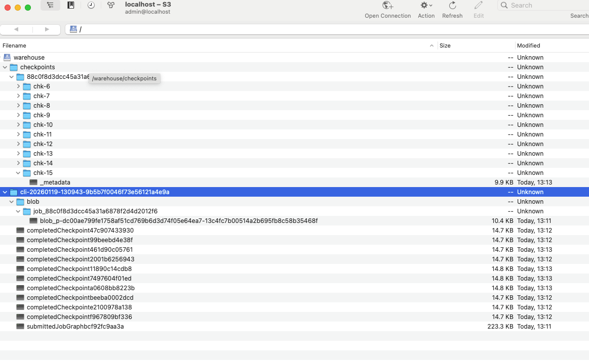

# CP Flink SQL

- [CP Flink SQL](#cp-flink-sql)
  - [Disclaimer](#disclaimer)
- [Setup](#setup)
  - [Start Kind K8s Cluster](#start-kind-k8s-cluster)
  - [Start Kafka](#start-kafka)
  - [Start S3proxy](#start-s3proxy)
  - [Install Confluent Manager for Apache Flink](#install-confluent-manager-for-apache-flink)
- [Flink SQL](#flink-sql)
  - [Let's Play](#lets-play)
    - [Producing to Kafka](#producing-to-kafka)
    - [SQL Shell](#sql-shell)
    - [Checkpoints](#checkpoints)
    - [Back to our SQL Shell](#back-to-our-sql-shell)
    - [Statements](#statements)
    - [Control Center UI Stops Displaying Issue](#control-center-ui-stops-displaying-issue)
- [Cleanup](#cleanup)

## Disclaimer

The code and/or instructions here available are **NOT** intended for production usage.
It's only meant to serve as an example or reference and does not replace the need to follow actual and official documentation of referenced products.

# Setup

## Start Kind K8s Cluster

```shell
kind create cluster --image kindest/node:v1.31.0
```

In order to run the k8s dashboard:

```shell
kubectl apply -f https://raw.githubusercontent.com/kubernetes/dashboard/v2.7.0/aio/deploy/recommended.yaml --context kind-kind
kubectl create serviceaccount -n kubernetes-dashboard admin-user
kubectl create clusterrolebinding -n kubernetes-dashboard admin-user --clusterrole cluster-admin --serviceaccount=kubernetes-dashboard:admin-user
token=$(kubectl -n kubernetes-dashboard create token admin-user)
echo $token
kubectl proxy
```

Copy the token displayed on output and use it to login in K8s dashboard at http://localhost:8001/api/v1/namespaces/kubernetes-dashboard/services/https:kubernetes-dashboard:/proxy/#/login

You may need to wait a couple of seconds for dashboard to become available.

Let it run and open another terminal.

In case you are logged out cause of inactivity you may see errors as:

```
E0225 13:50:19.136484   67149 proxy_server.go:147] Error while proxying request: context canceled
```

Just stop the proxy before and execute again and login with the new token.

## Start Kafka

Run:

```shell
kubectl create namespace confluent
kubectl config set-context --current --namespace=confluent
helm repo add confluentinc https://packages.confluent.io/helm
helm repo update
helm upgrade --install operator confluentinc/confluent-for-kubernetes \
  --version "0.1351.24"
```

Check pod is ready:

```shell
watch kubectl get pods
```

Once the operator pod is ready we install our CP nodes:

```shell
kubectl apply -f kafka/kafka.yaml
```

And wait for all pods (1 kraft, 1 broker, 1 SR, 1 C3) to be ready (it will take some time...):

```shell
watch kubectl -n confluent get pods
```

Once everything is completely ready you should have something like this:

```
NAME                                  READY   STATUS    RESTARTS        AGE
confluent-operator-66c65956d5-jdw9x   1/1     Running   0               6m36s
controlcenter-ng-0                    3/3     Running   0               5m54s
kafka-0                               1/1     Running   0               2m38s
kraftcontroller-0                     1/1     Running   0               5m54s
schemaregistry-0                      1/1     Running   5 (2m35s ago)   5m54s
```

Now we can forward the port of Control Center Next Generation:

```shell
kubectl -n confluent port-forward controlcenter-ng-0 9021:9021 > /dev/null 2>&1 &
```

And then open http://localhost:9021 and check topics `myevent` and `myaggregated` have been already created with their corresponding schemas as per `kafka/kafka.yaml` file.

You should see an error stating `The system cannot connect to Confluent Manager for Apache Flink.`. It's expected cause we didnt install it yet.

## Start S3proxy

Let's start S3proxy:

```shell
kubectl apply -f ./s3proxy/s3proxy-deployment.yaml
kubectl apply -f ./s3proxy/s3proxy-init-job.yaml
```

And wait for pods to be ready:

```shell
watch kubectl -n confluent get pods
```

You should see something as:

```
NAME                                  READY   STATUS      RESTARTS        AGE
confluent-operator-5dcb4c6b99-5dv57   1/1     Running     0               6m56s
controlcenter-ng-0                    3/3     Running     1 (3m2s ago)    6m35s
kafka-0                               1/1     Running     1 (4m40s ago)   4m50s
kraftcontroller-0                     1/1     Running     0               6m35s
s3proxy-695cc84bf-zgp77               1/1     Running     0               56s
s3proxy-init-pq9zm                    0/1     Completed   0               56s
schemaregistry-0                      1/1     Running     4 (5m5s ago)    6m35s
```

And then port-forward to access locally:

```shell
kubectl -n confluent port-forward service/s3proxy 8000:8000 > /dev/null 2>&1 &
```

You can use a client as `Cyberduck` to connect to. Open the profile file `./cyberduck/S3_http.cyberduckprodfile`. Configure: 

```
Protocol            S3Proxy (http, path-style)
Server              localhost
Port                8000
Access Key ID       admin
Secret Access Key   password
```

It should list just a single folder named `warehouse`.

## Install Confluent Manager for Apache Flink

Install certificate manager:

```shell
kubectl create -f https://github.com/jetstack/cert-manager/releases/download/v1.8.2/cert-manager.yaml
```

Wait until an endpoint IP is assigned when executing the following:

```shell
watch kubectl get endpoints -n cert-manager cert-manager-webhook
```

Install Flink Kubernetes Operator:

```shell
kubectl config set-context --current --namespace=confluent
helm repo add confluentinc  https://packages.confluent.io/hel
helm repo update
helm upgrade --install cp-flink-kubernetes-operator confluentinc/flink-kubernetes-operator --version "~1.130.0" --set watchNamespaces="{confluent}"
```

Install Confluent Manager for Apache Flink:

```shell
helm upgrade --install cmf confluentinc/confluent-manager-for-apache-flink \
    --version "~2.1.2" --set cmf.sql.production=false \
    --namespace confluent
```

Check pods are ready (CFO and CMF):

```shell
watch kubectl -n confluent get pods
```

Open port forwarding for CMF:

```shell
kubectl port-forward service/cmf-service 8080:80 -n confluent > /dev/null 2>&1 &
```

At this point no error `The system cannot connect to Confluent Manager for Apache Flink.` should show up in Control Center home page.

# Flink SQL

Let's first create our environment:

```shell
confluent flink environment create env1 --url http://localhost:8080 --kubernetes-namespace confluent
```

In case you get an error like this:

```
Error: you must log out of Confluent Cloud to use this command

Suggestions:
    Log out with `confluent logout`.
```

Make sure to login into confluent cloud `confluent login` and logout after `confluent logout` (in case doing the logout only gives you an error), and execute again the creation of environment.

We can list it:

```shell
confluent flink environment list --url http://localhost:8080
```

It should also be listed from the Control Center UI (with no more errors stating it cannot connect to Confluent Manager for Apache Flink SQL).

Now we can create our catalog (basically allowing Flink to automatically recognize our kafka cluster, topics and schema registry - no need to create tables and specify Flink connectors as usual with Apache Flink):

```shell
confluent flink catalog create flink/catalog.json --url http://localhost:8080
```
You should get something like:

```
+---------------+--------------------------+
| Creation Time | 2025-11-29T18:59:34.197Z |
| Name          | kafka-cat                |
| Databases     |                          |
+---------------+--------------------------+
```

With CMF 2.1 catalogs no longer embed Kafka clusters; you must create a separate KafkaDatabase under the catalog. The CLI does not yet support the creation of databases inside the catalog so we will use the CMF REST API:

```shell
curl -H "Content-Type: application/json" -X POST  http://localhost:8080/cmf/api/v1/catalogs/kafka/kafka-cat/databases -d @flink/database.json
```

You can list the databases with:

```shell
curl  http://localhost:8080/cmf/api/v1/catalogs/kafka/kafka-cat/databases
```

Now we can create our compute pool (There is no cp-flink-sql 2.x image in CP 8.1, so SQL compute pools must stay on 1.19):

```shell
confluent flink compute-pool create flink/compute-pool.json --environment env1 --url http://localhost:8080
```

We won't be able to see the compute pool listed in Control Center UI (at least on the current version) but we can list it:

```shell
confluent flink compute-pool list --environment env1 --url http://localhost:8080
```

## Let's Play

### Producing to Kafka

Now first lets excute our script that will populate the input topic `myevent` for that we will forward first the ports of the broker and schema registry:

```shell
kubectl port-forward -n confluent pod/kafka-0 9094:9094 > /dev/null 2>&1 &
kubectl port-forward svc/schemaregistry 8081:8081 -n confluent > /dev/null 2>&1 &
```

And then run the script:

```shell
./kafka/create_events.sh
```

You can see on Control Center the topic `myevent`start to get populated.

### SQL Shell

Now in another shell we can open a flink shell using our compute pool and query our topic:

```shell
confluent --url http://localhost:8080 --environment env1 --compute-pool pool flink shell
```

We can run the following query over our topic:

```sql
SELECT
  window_start,
  category,
  SUM(`value`) AS total_value,
  COUNT(`id`) AS event_count
FROM
  TABLE(
    TUMBLE(
      TABLE `myevent` ,
      DESCRIPTOR($rowtime), 
      INTERVAL '10' SECOND
    )
  )
GROUP BY
  window_start,
  window_end,
  category;
```

Meanwhile in another shell you could run:

```shell
watch kubectl -n confluent get pods
```

And see the Flink cluster (job manager and task manager) being instantiated (as per our compute pool template definition) to execute our query. Once running the Flink sql shell should start receiving the results from our query.

### Checkpoints

If you navigate to your warehouse bucket in S3proxy you should see something like:



Let's review the meaning of each folder/file:

- `checkpoints/` This is the checkpoint storage directory. A Flink checkpoint is a consistent snapshot of a running job’s state that Flink periodically saves so it can resume processing exactly from where it left off after a failure.
  - `922..`  That is the Flink JobID (one folder per running job). You will probably just have one for the Flink SQL you submitted on the shell.
  - `chk-19`, `chk-20`, ... Each chk-N is one completed checkpoint (N is the checkpoint ID counter). We have configured `state.checkpoints.num-retained` equal to 10. So only the last 20 checkpoints at each moment will be kept.
  - `_metadata` This is the checkpoint “manifest” file. It contains the serialized metadata that tells Flink: which operators/tasks were snapshotted, what state handles exist, where the state files are and how to restore the job from that checkpoint. Since our job’s state is small, Flink will store it in a very compact way in _metadata.
- `cli-2026-01-18-...`  It’s not the checkpoint state itself — it’s the stuff Flink needs so the cluster/job can recover after a JobManager failure. What's configured by `high-availability.storageDir` set to `s3://warehouse/`.
  - `blob\`  This is Flink’s BLOB store (binary large objects). It holds artifacts needed to run/recover the job, such as: uploaded JARs (if any), serialized execution plan pieces, sometimes SQL client artifacts, etc.
    - `job_1f1ca098…/`  Per-job subdirectory in the HA/BLOB storage (again that long hex is the JobID).
      - `blob_p-…` The permanent blob entry.
    - `completedCheckpoint…` This is NOT the checkpoint data. It’s HA metadata that represents the CompletedCheckpointStore pointer/registry (basically “what checkpoints are considered completed and usable for recovery” and references to them).
    - `submittedJobGraph…` This is the submitted JobGraph (the job definition that the dispatcher/jobmanager uses to recover the job after failover). If the JM dies and comes back, this is one of the things it consults to resubmit/recreate execution. 
- `job-result-store/` You may not have this one. It's used by Flink’s Dispatcher / HA layer to persist the final outcome of a job so that: the cluster knows whether a job FINISHED, FAILED, or was CANCELED; the result survives JobManager restarts; clients (SQL Client, REST API) can still query job status after termination. This is not checkpoint state and not HA blobs — it’s purely job lifecycle metadata.
  - `cli-2026-01-18-01461…-9892` This is the Dispatcher / client session ID (same prefix you saw elsewhere). Think: “this SQL Client / session submitted jobs under this namespace” 
    - `d521c45a-e90f-481d-9d2c-9fed17510066` This is the JobID of the job completed, failed or canceled.
      - `…_DIRTY.json` A job result marked as DIRTY means: “This job did not terminate in a globally clean, finalized way.” Typical causes: Job was CANCELLED, JobManager crashed during termination, HA recovery was interrupted. In contrast: SUCCESS.json → job finished normally, FAILED.json → job failed with an exception. Usually contains: jobId, application / job name, final status = CANCELED/FINISHED/FAILED, timestamps, possibly partial execution metadata. It’s intentionally small.


### Back to our SQL Shell

Once you hit `Q` quiting the execution of the query the cluster created should be terminated.

Now you can quit the sql shell `quit;`. 

### Statements

We can deploy our full statement that will populate the other topic `myaggreagted` with the query results:

```shell
confluent --environment env1 flink statement create flink-statement \
  --catalog kafka-cat \
  --database main-kafka-cluster \
  --compute-pool pool \
  --parallelism 1 \
--sql $'INSERT INTO `myaggregated` 
/*+ OPTIONS(\'properties.transaction.timeout.ms\'=\'300000\') */
SELECT
  CAST(null as bytes) ,
  window_start,
  category,
  SUM(`value`) AS total_value,
  COUNT(`id`) AS event_count
FROM
  TABLE(
    TUMBLE(
      TABLE \`myevent\` ,
      DESCRIPTOR($rowtime), 
      INTERVAL \'10\' SECOND
    )
  )
GROUP BY
  window_start,
  window_end,
  category;' \
  --url http://localhost:8080
```

You should get as response something like this:

```
+---------------+-------------------------------------------------------+
| Creation Date | 2025-07-28T23:48:14.523Z                              |
| Name          | flink-statement                                       |
| Statement     | INSERT INTO `myaggregated`  /*+                       |
|               | OPTIONS('properties.transaction.timeout.ms'='300000') |
|               | */ SELECT   CAST(null as bytes) ,   window_start,     |
|               |   category,   SUM(`value`) AS total_value,            |
|               | COUNT(`id`) AS event_count FROM   TABLE(     TUMBLE(  |
|               |       TABLE `myevent` ,       DESCRIPTOR($rowtime),   |
|               |        INTERVAL '10' SECOND     )   ) GROUP BY        |
|               | window_start,   window_end,   category;               |
| Compute Pool  | pool                                                  |
| Status        | PENDING                                               |
| Status Detail | Statement execution pending.                          |
| Parallelism   | 1                                                     |
| Stopped       | false                                                 |
| SQL Kind      | INSERT_INTO                                           |
| Append Only   | true                                                  |
+---------------+-------------------------------------------------------+
```

You can check the start of the pods (jobmanager and taskmanager) for the execution of our statement just like before with:

```shell
watch kubectl -n confluent get pods
```

Once running if you go in Control Center to the message viewer of the topic `myaggregated` you should be able to see it getting populated.

You can check the status of the statement execution by running:

```shell
confluent flink statement list --environment env1 --url http://localhost:8080
```

You can also open the Flink UI by executing:

```shell
kubectl port-forward service/flink-statement-rest 8082:8081 -n confluent > /dev/null 2>&1 &
```

And then access http://localhost:8082

If you wish to delete the statement just execute:

```shell
confluent --environment env1 flink statement delete flink-statement --url http://localhost:8080
```

You should see the pods getting terminated with:

```shell
watch kubectl -n confluent get pods
```

### Control Center UI Stops Displaying Issue

You may loose access to Control Center UI. In such cases you will need to stop the process ocuppying the port 9021 (the forward of the C3 pod) and restart the forwarding. If you are on a mac do as follows:

```shell
sudo lsof -i :9021
```

This will give you the PID of the process that you need to kill.

Then reexecute:

```shell
kubectl -n confluent port-forward controlcenter-ng-0 9021:9021 > /dev/null 2>&1 &
```

# Cleanup

```shell
kind delete cluster
```
